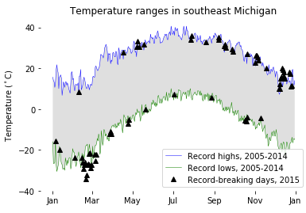
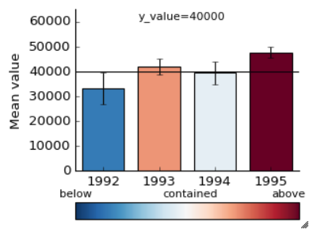

# coursera_2_applied_plotting_python
My work from Coursera's Applied Plotting, Charting & Data Representation in Python course, the second course in the data science specialization through UM. The course is hosted here: <https://www.coursera.org/learn/python-plotting/home/welcome>

# Author info
Patricia Schuster  
June 2018  
University of Michigan  

# Week 1: Principles of Information Visualization

* [Reading assignment on misleading graphics](week_1/reading_assignment.md)
* [Assignment](week_1/assignment1.md) to evaluate a misleading graphic

# Week 2: Basic Charting

* [Notes](week_2/Week2.ipynb)
    * `matplotlib` architecture
    * Scatterplots, line plots, bar charts
    * Removing lines, changing style, "dejunkifying" a figure
* [Assignment](week_2/Assignment2.ipynb)
    * Creating a figure of highs and lows in Michigan
    * Final figure:
    

# Week 3: Charting Fundamentals

* [Notes](week_3/Week3_charting_fundamentals.ipynb)
    * Subplots, `sharex`, `sharey`, grids
    * Histogram, sampling, box plot
    * GridSpec layout, inset axes
    * Animation, interactivity
* [Assignment](week_3/Assignment3.ipynb): Building a custom visualization
    * Color code the bars to represent the likelihood that a given y-value is contained in that bar, subject to uncertainty on the bar height
    * Three options of difficulty
    * Final figure:
    

# Week 4: Applied Visualizations

* [Notes](week_4/Week4_applied_visualizations.ipynb)
    * Plotting directly from a `pandas DataFrame`.
    * `kind` input to change plot type
    * Seaborn, `jointplot`, violin plots
* [Assignment](week_4/Assignment4.ipynb)
    * Create a custom graphic on UM vs. MSU football. Data taken from Wikipedia
    * Identify coach eras, plot individual years and average by coach.
    * Add interactivity with picker to get coach name
    * Final figure:
    
